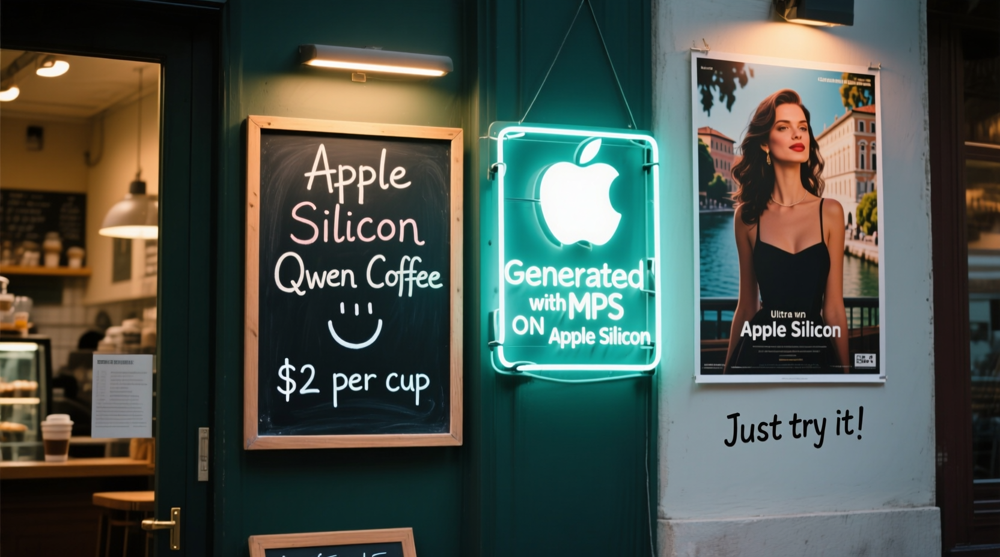

## Qwen Image (MPS/CUDA/CPU)

Generate images from text prompts using the Hugging Face Diffusers pipeline for `Qwen/Qwen-Image`, with automatic device selection for Apple Silicon (MPS), NVIDIA CUDA, or CPU fallback.

### Features
- **Auto device selection**: prefers MPS (Apple Silicon), then CUDA, else CPU
- **Simple CLI**: provide a prompt and number of steps
- **Timestamped outputs**: avoids overwriting previous generations
- **Fast mode**: 8-step generation using Lightning LoRA (auto-downloads if needed)
 - **Multi-image generation**: generate multiple images in one run with `--num-images`

### Example

Example result you can create with this project:



## Quickstart

### 1) Python and virtual environment
```bash
uv venv -p 3.12
source .venv/bin/activate
uv pip install -r requirements.txt
source .venv/bin/activate
```

## Usage

The main entry point is `qwen-image-mps.py`.

```bash
python qwen-image-mps.py --help
```

Examples:

```bash
# Default prompt and steps
python qwen-image-mps.py

# Custom prompt and fewer steps
python qwen-image-mps.py -p "A serene alpine lake at sunrise, ultra detailed, cinematic" -s 30

# Fast mode with Lightning LoRA (8 steps)
python qwen-image-mps.py -f -p "A magical forest with glowing mushrooms"

# Custom seed for reproducible generation
python qwen-image-mps.py --seed 42 -p "A vintage coffee shop"

# Generate multiple images (incrementing seed per image)
python qwen-image-mps.py -p "Retro sci-fi city skyline at night" --num-images 3 --seed 100
```

### Arguments
- `-p, --prompt` (str): Prompt text for image generation.
- `-s, --steps` (int): Number of inference steps (default: 50).
- `-f, --fast`: Enable fast mode using Lightning LoRA for 8-step generation.
- `--seed` (int): Random seed for reproducible generation (default: 195).
 - `--num-images` (int): Number of images to generate (default: 1).

## What the script does
- Loads `Qwen/Qwen-Image` via `diffusers.DiffusionPipeline`
- Selects device and dtype:
  - MPS: `bfloat16`
  - CUDA: `bfloat16`
  - CPU: `float32`
- Uses a light positive conditioning suffix for quality
- Generates at a 16:9 resolution (default `1664x928`)
- Saves the output as `image-YYYYMMDD-HHMMSS.png` for a single image,
  or `image-YYYYMMDD-HHMMSS-1.png`, `image-YYYYMMDD-HHMMSS-2.png`, ... when using `--num-images`
- Prints the full path of the saved image

### Fast Mode (Lightning LoRA)
When using the `-f/--fast` flag, the script:
- Automatically downloads the Lightning LoRA from Hugging Face if not present
- Merges the LoRA weights into the model for accelerated generation
- Uses fixed 8 inference steps with CFG scale 1.0
- Provides ~6x speedup compared to the default 50 steps

The fast implementation is based on [Qwen-Image-Lightning](https://github.com/ModelTC/Qwen-Image-Lightning).

## Notes and tweaks
- **Aspect ratio / resolution**: The script currently uses the `16:9` entry from an `aspect_ratios` map. You can change the selection in the code where `width, height` is set.
- **Determinism**: Use the `--seed` parameter to control the random generator for reproducible results. On MPS, the random generator runs on CPU for improved stability.
- **Performance**: If you hit memory or speed issues, try reducing `--steps`.

## Troubleshooting
- If you see "Using CPU" in the console on Apple Silicon, ensure your PyTorch build includes MPS and you are running on Apple Silicon Python (not under Rosetta).
- If model download fails or is unauthorized, log in with `huggingface-cli login` or accept the model terms on the Hugging Face model page.

## Repository contents
- `qwen-image-mps.py`: CLI to generate an image from a text prompt
- `requirements.txt`: Python dependencies
- `example.png`: Sample image (not generated by the script)


